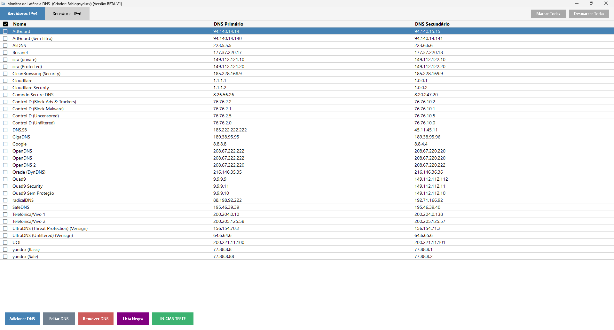
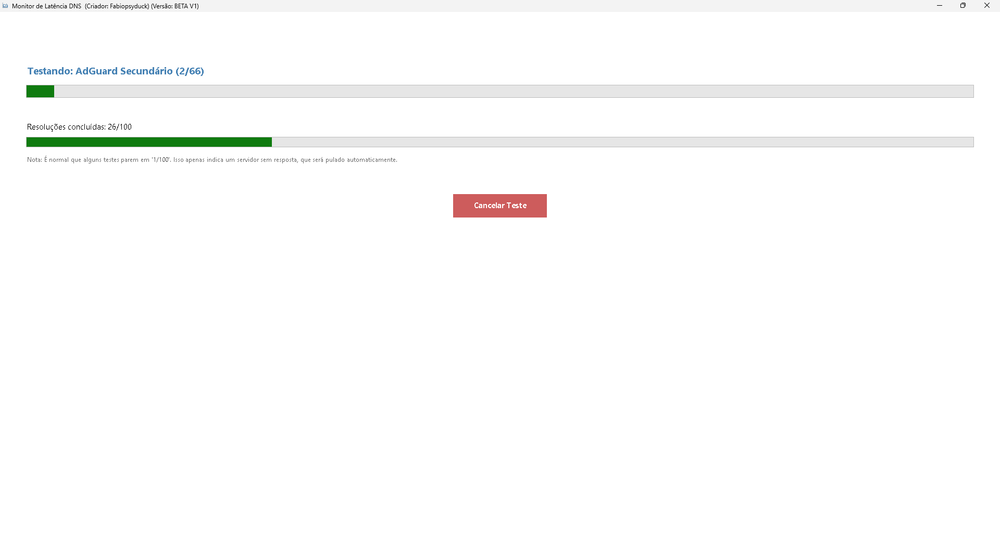
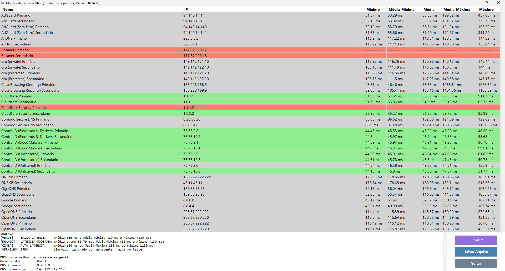
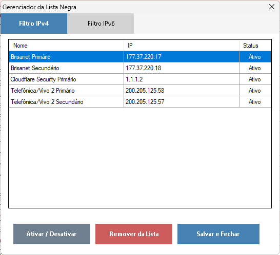

# Monitor de Latência DNS

**Descubra os servidores DNS mais rápidos para a sua conexão. Utilitário completo com interface amigável, ranking de velocidade e sistema de exclusão.**

O **Monitor de Latência DNS** é uma ferramenta robusta desenvolvida em PowerShell com interface gráfica (WinForms) projetada para entusiastas de rede e usuários que buscam otimizar sua conexão de internet. Através de testes precisos, a aplicação avalia a performance de diversos servidores DNS, ajudando você a escolher a melhor rota para sua navegação ou jogos.

---

## 🚀 Funcionalidades

- **Compatibilidade com Conexões Modernas (IPv4 e IPv6):** Gerenciamento e testes completos tanto para o padrão de internet atual (IPv4) quanto para o novo protocolo (IPv6), de forma simples e direta.
- **Metodologia de Teste de Estresse:** O script realiza 100 medições consecutivas de tempo de resposta com um intervalo de apenas 25 milissegundos entre elas. Isso garante que o resultado não seja apenas uma "foto" momentânea, mas sim um filme real da estabilidade do servidor sob carga.
- **Análise de Temperamento da Conexão:** O sistema fornece 5 métricas de tempo (Mínimo, Média-Mínima, Média, Média-Máxima e Máximo). Essa análise detalhada permite que o usuário entenda o "temperamento" da IP testada, identificando se o servidor sofre com oscilações (jitter) ou picos repentinos de lentidão.
- **Sistema de Lista Negra (Blacklist):** Filtre automaticamente IPs sem resposta para que sejam ignorados em testes futuros, mantendo sua lista sempre limpa e funcional.
- **Exportação de Dados:** Salve os resultados detalhados em arquivos `.txt` formatados para análise posterior ou compartilhamento.

---

## 📸 Capturas de Tela

Aqui você pode visualizar a interface do programa em operação:

### 1. Tela Principal
Interface de gerenciamento onde você pode selecionar, adicionar e editar seus servidores DNS preferidos.


### 2. Execução de Testes
Monitoramento em tempo real com barras de progresso macro e micro, exibindo o status individual de cada servidor durante a bateria de 100 testes.


### 3. Tela de Resultados
Exibição das 5 métricas de tempo e classificação por cores, permitindo visualizar a estabilidade e o comportamento da IP.


### 4. Gerenciamento de Lista Negra
Controle total sobre os IPs isolados por falta de resposta durante os testes.


---

## 📦 Como Usar

1. **Script PowerShell:** Baixe o arquivo `.ps1` e execute-o com o botão direito -> *Run with PowerShell*.
2. **Servidores DNS:** Para facilitar, este repositório inclui um arquivo zipado com uma lista de servidores DNS já montada. Basta extrair na pasta do script.
3. **Versão Executável:** Se preferir não lidar com scripts, disponibilizei uma versão já convertida para `.exe` na seção de [Releases/Arquivos].

---

## 🛠️ Compilação Manual (PowerShell para EXE)

Se você for um desenvolvedor e desejar converter o script `.ps1` em um executável `.exe` por conta própria, recomenda-se o uso da ferramenta **ps2exe**.

Para garantir que a interface gráfica e o suporte a caracteres especiais funcionem corretamente, os seguintes parâmetros são **obrigatórios**:

```powershell
ps2exe.ps1 -inputFile .\Monitor_de_Latencia.ps1 -outputFile .\Monitor_de_Latencia.exe -supportOS -sta -noConsole -unicodeEncoding
